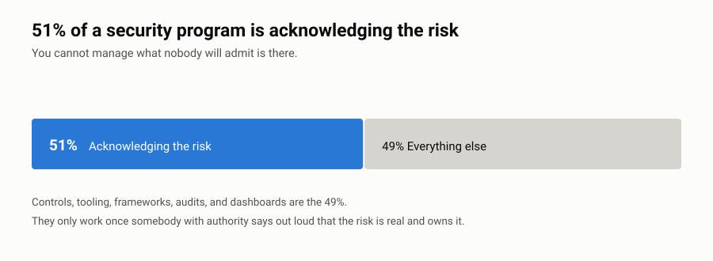

# Board Cyber Briefings

Templates and notes for briefing a board on cybersecurity, from somebody who's spent 30 years doing it.

Most security people are good at security and bad at boards. That's not a knock. Nobody teaches it, the feedback loop is terrible, and you get one shot a quarter to practice. This is what I wish somebody had handed me before my first one.

---

## 51% of a Security Program Is Acknowledging the Risk

<picture>
  <source media="(prefers-color-scheme: dark)" srcset="charts/fifty-one-percent-dark.svg">
  
</picture>

Every real fix I've been part of started with somebody senior saying out loud that a risk was real. Controls and tools and audits are the other 49%. All dead weight until somebody admits the problem exists.

Which makes the board conversation the actual control. That's what this repo is for.

One of eleven things I say a lot. Rest are in [PRINCIPLES.md](https://github.com/HarrisonWard/.github/blob/main/PRINCIPLES.md).

---

## Who It's For

- CISOs and vCISOs presenting to a board or audit committee
- CTOs and CIOs who own security as part of a bigger job
- Anybody reporting to an exec team who wants the same discipline
- Consultants prepping a client for a board conversation

## Who It's Not For

Anybody looking for compliance evidence. This is about talking to people, not proving things to auditors.

---

## What's in Here

| File | What it is |
|---|---|
| `quarterly-update/` | The standard quarterly update, slide by slide, with notes on why each one is there |
| `incident-briefing/` | Briefing a board during and after something bad |
| `budget-case/` | Asking for money in a way that survives a CFO |
| `metrics-guide.md` | What to show a board, what to never show, what each number actually says |
| `language-bank.md` | How to say hard things without causing a panic or losing the room |
| `pre-read.md` | The one-pager, and why it changes the whole meeting |
| `examples/` | Bad version and better version, side by side, with notes on what changed |

---

## Three Things That Took Me Too Long to Figure Out

**The Board Isn't Asking "Are We Secure."** They're asking "is this guy on top of it, and am I going to be embarrassed." Answer the question they're actually asking.

**A number with no trend and no target is noise.** "We blocked 4 million emails" tells a director nothing. "Click rate is 4%, down from 11% last year, we want it under 3%" tells them you're running something.

**Bad news early is competence. Bad news they find out later is negligence.** The urge to wait until you have a fix is the urge that ends careers. Say it. Then say what you're doing about it.

---

## How to Use This

Don't present any of it as-is. These are shapes, not scripts.

Start with `metrics-guide.md`. Pick four to six numbers you can actually produce every quarter. Consistency beats sophistication every time.

Build your deck on the `quarterly-update/` structure. Write the pre-read. The pre-read is the highest-value thing in here and it's the thing everybody skips.

Read `language-bank.md` before you have to deliver something uncomfortable.

Take what fits. Throw out the rest. Every board has its own personality and you'll know yours inside two meetings.

---

## What This Isn't

Not legal advice. Not regulatory guidance. Board reporting obligations change by sector, jurisdiction, and company structure. If you're public or regulated, your general counsel needs to see anything before you present it.

These are communication templates. They won't make your program good. They'll help you describe a good one accurately, and describe a weak one straight.

---

## Contributing

Present to boards and do it differently? Tell me. I especially want to hear from sectors I've spent less time in. Healthcare systems, higher ed, public sector.

Nothing client-identifiable. No board minutes. See [CONTRIBUTING.md](CONTRIBUTING.md).

---

## License

[CC BY 4.0](https://creativecommons.org/licenses/by/4.0/). Use it, change it, use it commercially. Just say where you got it.

© 2026 Harrison Ward

---

## Me

Cyber risk and technology exec. Former CTO of a five-office professional services firm. Most recently SVP in Kroll's Cyber Risk practice, sitting as vCISO for enterprise clients in regulated and critical infrastructure.

[github.com/HarrisonWard](https://github.com/HarrisonWard) · [LinkedIn](https://linkedin.com/in/harrisonaward)

---

*Published under [these principles](https://github.com/HarrisonWard/.github/blob/main/PRINCIPLES.md). Security Shouldn't Be Paywalled.*
